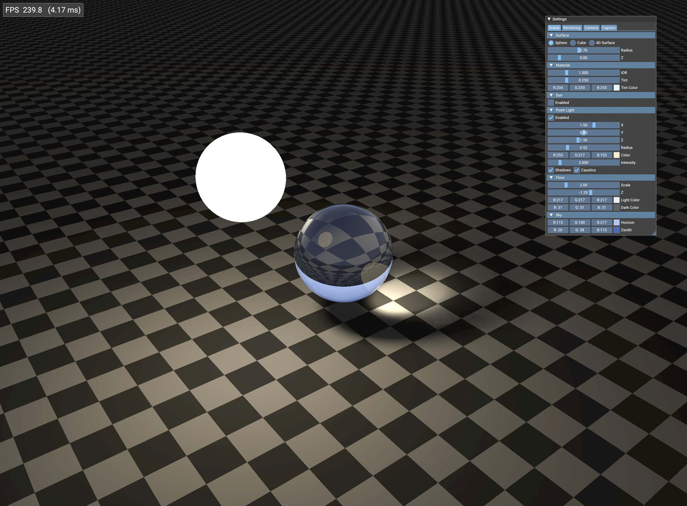
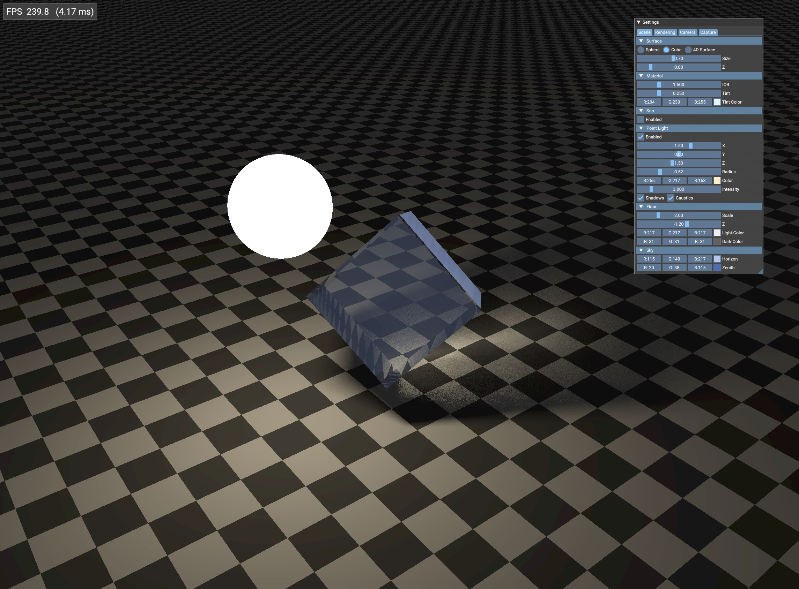
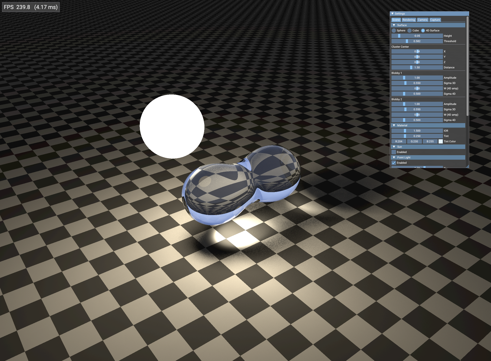

# Vibe coding test project

A Vulkan ray tracing application generated via vibe coding with Claude Code, used to test AI-assisted C++ graphics development.

## Screenshots

| | | |
|:---:|:---:|:---:|
|  |  |  |
| Glass sphere with caustics | Checkerboard cube surface | 4D Blobby hypersurface |

## What it does

Ray traces an analytic glass object on a checkerboard floor, with configurable sun and point lighting, caustics, reflections, and refractions. The surface shape, material, lighting, and camera are all adjustable at runtime via an ImGui settings panel.

## Build & Run

```bash
make run
```

## **Dependencies**:

### Ubuntu/Debian
```bash
sudo apt-get install -y vulkan-tools libvulkan-dev glslang-tools libglfw3-dev libglm-dev
```

### Arch Linux:
```bash
sudo pacman -S vulkan-tools vulkan-headers glslang glfw-x11 glm
```
> Use `glfw-wayland` instead of `glfw-x11` if running a Wayland compositor.

## Structure

```
src/                        # C++ source
  Application.cpp           # Vulkan setup, swapchain, ray tracing pipeline
  ControlPanel.cpp          # ImGui settings panel
  ScreenshotManager.cpp     # screenshot capture UI and logic
shaders/                    # GLSL ray tracing shaders
  shader.rgen               # ray generation
  shader.rchit / .rmiss     # glass BSDF, floor/sky, shadow/caustic
  shader.rint               # analytic sphere intersection
Makefile                    # compiles shaders (SPIR-V) and C++
```
